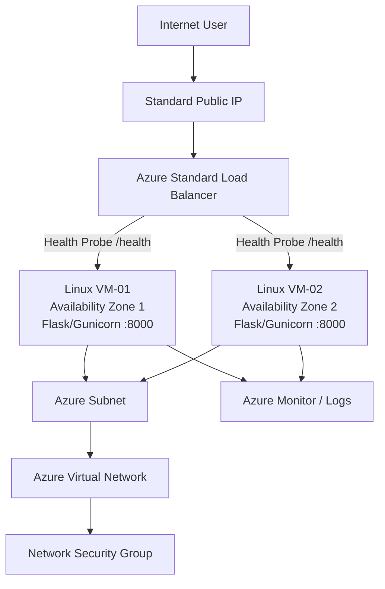
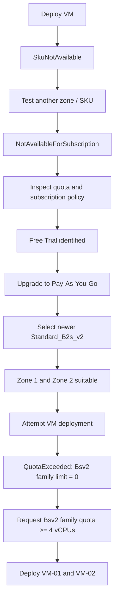

# Azure Highly Available Web Application

A hands-on Azure/DevOps portfolio project to build and operate a highly available Python web application on Microsoft Azure across multiple Availability Zones.

The goal is to demonstrate practical Azure administration, networking, Linux, troubleshooting, high availability, monitoring, Infrastructure as Code, and CI/CD skills.

## Project Status

**Current phase:** Azure compute deployment and quota remediation  
**Overall progress:** approximately 35%

### Completed

- [x] Built and tested the Python Flask application locally
- [x] Added a `/health` endpoint for load-balancer health checks
- [x] Created the GitHub repository and local Git workflow
- [x] Created Azure resource group `rg-olu-ha-webapp`
- [x] Created VNet `vnet-olu-ha`
- [x] Created subnet `snet-web`
- [x] Created and attached NSG `nsg-web`
- [x] Created an inbound application rule for TCP port `8000`
- [x] Investigated VM SKU availability across regions and zones
- [x] Identified subscription-level SKU restrictions
- [x] Verified the subscription was originally an Azure Free Trial
- [x] Upgraded the subscription to Pay-As-You-Go
- [x] Identified `Standard_B2s_v2` as the preferred newer-generation VM SKU
- [x] Confirmed the planned architecture can use Availability Zones 1 and 2
- [x] Diagnosed the current blocker as a per-VM-family Bsv2 vCPU quota of 0

### In Progress / Next

- [ ] Request/increase the UK South `standardBsv2Family` quota to at least 4 vCPUs
- [ ] Deploy `vm-olu-web-01` in Availability Zone 1
- [ ] Deploy `vm-olu-web-02` in Availability Zone 2
- [ ] Install and run the Flask application on both Linux VMs
- [ ] Configure Gunicorn/systemd
- [ ] Create a Standard Public IP
- [ ] Create an Azure Standard Load Balancer
- [ ] Create the backend pool
- [ ] Configure the HTTP `/health` probe
- [ ] Configure the load-balancing rule
- [ ] Test application availability through the Load Balancer
- [ ] Stop one VM and prove failover to the remaining healthy VM
- [ ] Add Azure Monitor / logging
- [ ] Rebuild the infrastructure using Terraform
- [ ] Add GitHub Actions CI/CD
- [ ] Complete final architecture and deployment documentation

---

## Target Architecture



The final application will run on two Linux virtual machines in separate Availability Zones. Azure Load Balancer will health-check the application through `/health`. If one VM becomes unhealthy or is deliberately stopped, traffic should continue to the remaining healthy backend.

---

## Application

The application is a lightweight Python Flask web application running on port `8000`.

It displays the hostname of the responding server so the final deployment can demonstrate that requests are being served by the highly available backend tier.

### Health Endpoint

```text
GET /health
```

Expected response:

```text
healthy
```

---

## Azure Networking

| Component | Configuration |
|---|---|
| Resource Group | `rg-olu-ha-webapp` |
| Region | UK South |
| Virtual Network | `vnet-olu-ha` |
| VNet CIDR | `10.0.0.0/16` |
| Subnet | `snet-web` |
| Subnet CIDR | `10.0.1.0/24` |
| Network Security Group | `nsg-web` |
| Application Port | TCP `8000` |
| Planned VM Zone 1 | `vm-olu-web-01` |
| Planned VM Zone 2 | `vm-olu-web-02` |
| Preferred VM Size | `Standard_B2s_v2` |

> The current port 8000 NSG rule is intentionally broad for initial testing. It will be tightened when the final Load Balancer architecture is completed.

---

# Challenges and Troubleshooting

A major part of this project has been learning how to diagnose Azure deployment failures systematically instead of repeatedly changing commands without understanding the cause.

## 1. Initial VM Deployment Failed

The first planned VM size was `Standard_B1s`.

Azure rejected the deployment with a `SkuNotAvailable` / capacity-related error in UK South.

### Lesson

A deployment failure at the compute layer does not automatically mean the VNet, subnet, NSG, or application configuration is wrong.

---

## 2. Alternative VM Sizes and Zones Were Tested

`Standard_B2s` was tested across multiple Availability Zones. Other small VM sizes were also investigated.

The same general deployment problem continued.

This established an important Azure principle:

> A VM SKU being listed in a region does not guarantee that it is deployable for a specific subscription and Availability Zone.

---

## 3. Subscription-Level SKU Restrictions Were Identified

Targeted Azure CLI queries revealed:

```text
reasonCode: NotAvailableForSubscription
```

The restriction appeared across several VM families and more than one region.

At this point, troubleshooting shifted away from randomly testing VM sizes and toward understanding the Azure subscription itself.

---

## 4. Regional Quota Was Checked

Compute usage and limits were inspected with:

```bash
az vm list-usage --location uksouth --output table
```

The earlier subscription view showed regional compute headroom, confirming that the issue was not simply "all Azure vCPUs are exhausted."

This led to a deeper investigation of subscription policy and SKU-specific restrictions.

---

## 5. Free Trial Subscription Was Identified

The Azure subscription policy was queried directly.

It initially returned:

```text
quotaId: FreeTrial_2014-09-01
spendingLimit: On
```

### Resolution

The subscription was upgraded to Pay-As-You-Go.

After the upgrade:

```text
quotaId: PayAsYouGo_2014-09-01
spendingLimit: Off
```

This demonstrated that infrastructure deployment can be affected by the subscription offer itself, not just by infrastructure code.

---

## 6. Newer Bsv2 SKU Was Selected

After upgrading the subscription, `Standard_B2s_v2` was checked.

The SKU is suitable for the project in Availability Zones 1 and 2, while Zone 3 is restricted for this subscription/location combination.

The design was therefore kept as:

```text
UK South
├── Zone 1 -> vm-olu-web-01
└── Zone 2 -> vm-olu-web-02
```

This preserves the high-availability design across separate failure domains.

---

## 7. Per-Family vCPU Quota Became the Next Blocker

When deployment of `Standard_B2s_v2` was attempted, Azure returned:

```text
QuotaExceeded
standardBsv2Family
Current Limit: 0
Current Usage: 0
Additional Required: 2
```

This revealed a second quota layer:

- **Regional vCPU quota** controls the total number of vCPUs available in a region.
- **VM-family quota** controls how many vCPUs can be used by a specific VM family.

The subscription can therefore have regional quota available while still having a family-specific limit of zero.

### Required Resolution

Each `Standard_B2s_v2` VM uses 2 vCPUs.

The final HA architecture requires two VMs:

```text
VM-01 = 2 vCPUs
VM-02 = 2 vCPUs
Total  = 4 Bsv2-family vCPUs
```

The UK South `standardBsv2Family` quota therefore needs to be increased to **at least 4 vCPUs** before both backend VMs can run simultaneously.

---

## Troubleshooting Flow



---

## Engineering Lessons So Far

This project has already demonstrated several real-world cloud engineering skills:

- Reading and isolating Azure CLI deployment errors
- Separating networking problems from compute problems
- Understanding regional, zonal, subscription, and VM-family restrictions
- Checking Azure quotas instead of assuming capacity
- Investigating subscription policy directly
- Adapting architecture without abandoning the original high-availability objective
- Persisting through failed deployments using evidence-driven troubleshooting

The project intentionally documents these challenges because successful cloud engineering is not only about creating resources when everything works first time; it is also about diagnosing why deployments fail and choosing the correct remediation.

---

## Planned Technologies

- Microsoft Azure
- Azure Virtual Machines
- Azure Virtual Network
- Network Security Groups
- Azure Load Balancer
- Azure Monitor
- Linux / Ubuntu
- Python
- Flask
- Gunicorn
- systemd
- Git / GitHub
- Terraform
- GitHub Actions
- Azure CLI

---

## Final Portfolio Goal

At completion, this repository will demonstrate the ability to:

1. Build and deploy a Linux-hosted web application on Azure.
2. Design for high availability across multiple Availability Zones.
3. Configure Azure networking and security.
4. Use health probes and load balancing.
5. Validate resilience by deliberately removing a backend VM.
6. Monitor infrastructure and application health.
7. Reproduce infrastructure using Terraform.
8. Automate delivery with GitHub Actions.
9. Troubleshoot real Azure subscription, SKU, zone, and quota limitations.
