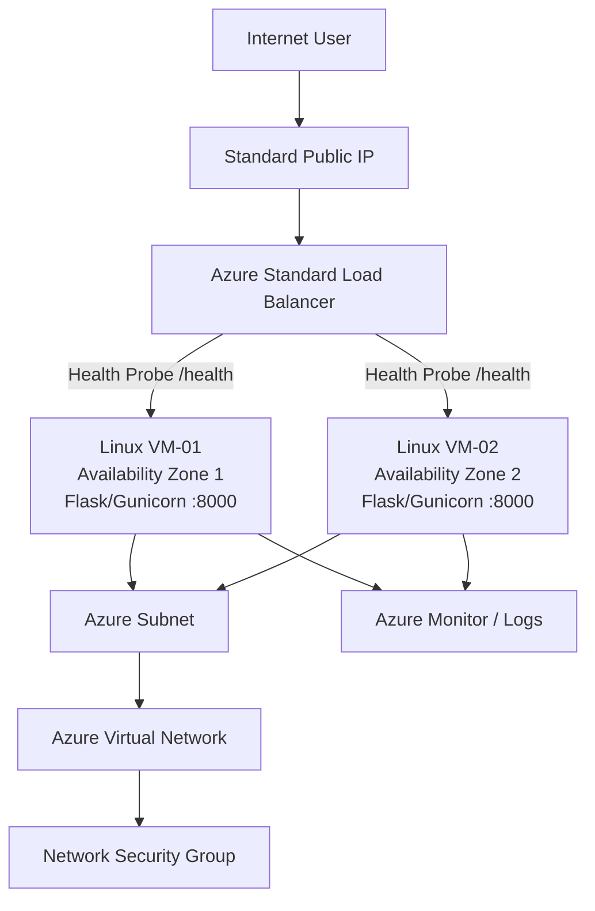
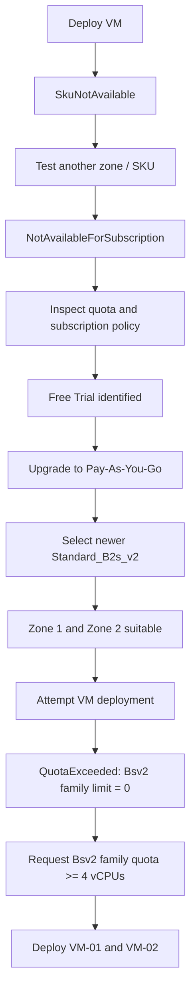
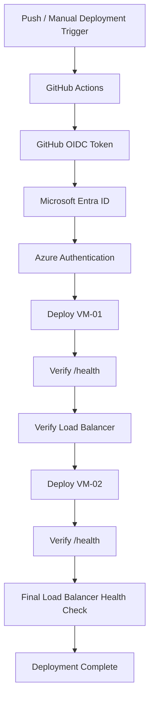

# Azure Highly Available Web Application

A hands-on Azure/DevOps portfolio project to build and operate a highly available Python web application on Microsoft Azure across multiple Availability Zones.

The goal is to demonstrate practical Azure administration, networking, Linux, troubleshooting, high availability, monitoring, Infrastructure as Code, and CI/CD skills.

## Project Status

**Current phase:** Complete — portfolio-ready Azure HA / DevOps project  
**Overall progress:** 100%

### Completed

- [x] Built and tested the Python Flask application locally
- [x] Added a `/health` endpoint for load-balancer health checks
- [x] Created the GitHub repository and local Git workflow
- [x] Created Azure resource group `rg-olu-ha-webapp`
- [x] Created VNet `vnet-olu-ha`
- [x] Created subnet `snet-web`
- [x] Created and attached NSG `nsg-web`
- [x] Created an inbound application rule for TCP port `8000`
- [x] Investigated VM SKU availability across regions and zones
- [x] Identified subscription-level SKU restrictions
- [x] Verified the subscription was originally an Azure Free Trial
- [x] Upgraded the subscription to Pay-As-You-Go
- [x] Identified `Standard_B2s_v2` as the preferred newer-generation VM SKU
- [x] Confirmed the planned architecture can use Availability Zones 1 and 2
- [x] Diagnosed the Bsv2 per-family quota blocker
- [x] Registered the `Microsoft.Quota` resource provider
- [x] Increased the UK South `standardBsv2Family` quota to 4 vCPUs
- [x] Deployed `vm-olu-web-01` in Availability Zone 1
- [x] Deployed `vm-olu-web-02` in Availability Zone 2
- [x] Verified both VMs are running in separate Availability Zones
- [x] Installed Python, Git, Flask dependencies and Gunicorn on `vm-olu-web-01`
- [x] Started Gunicorn on `vm-olu-web-01` and verified `/health` returns `healthy`

### Completed Build

- [x] Installed the application dependencies on `vm-olu-web-02`
- [x] Started Gunicorn on `vm-olu-web-02` and verified `/health` returns `healthy`
- [x] Configured and verified the persistent `systemd` service on `vm-olu-web-01`
- [x] Configured and verified the persistent `systemd` service on `vm-olu-web-02`
- [x] Both Availability Zone backends now run the app persistently and return `healthy`
- [x] Configure Gunicorn/systemd
- [x] Created zone-redundant Standard static Public IP `pip-olu-ha-lb`
- [x] Created Azure Standard Load Balancer `lb-olu-ha` with frontend `fe-olu-ha` and backend pool `be-olu-ha`
- [x] Attached both VM NICs to backend pool `be-olu-ha`
- [x] Configured HTTP health probe `probe-olu-health` on port `8000` and path `/health`
- [x] Configured load-balancing rule `rule-http` from frontend port `80` to backend port `8000`
- [x] Verified application availability through the Load Balancer public IP
- [x] Deallocated `vm-olu-web-01` and proved successful failover through the Load Balancer to `vm-olu-web-02`
- [x] Add Azure Monitor / logging
  - [x] Created Log Analytics workspace `law-olu-ha` in UK South with 30-day retention
  - [x] Enabled system-assigned managed identities on both backend VMs
  - [x] Azure Monitor Agent installed on both backend VMs
  - [x] Created Data Collection Rule `dcr-olu-ha` for performance counters and Syslog
  - [x] Associated `dcr-olu-ha` with both backend VMs
  - [x] Verified Azure Monitor Agent heartbeats from both backend VMs in Log Analytics
  - [x] Corrected Linux performance counter definitions in `dcr-olu-ha`
  - [x] Verified Azure Monitor Heartbeat and Syslog ingestion from both backend VMs
  - [ ] `Perf` records remain pending verification and are documented as a monitoring troubleshooting item
- [x] Define and import the live Azure infrastructure with Terraform
- [x] Achieve a clean Terraform plan with no infrastructure drift
- [x] Add GitHub Actions CI for Flask health checks and Terraform format/validation
- [x] Configure GitHub-to-Azure OIDC authentication without a stored Azure client secret
- [x] Add a rolling CD workflow across both backend VMs
- [x] Verify Load Balancer health between VM deployments and after the final deployment
- [x] Complete final architecture and deployment documentation

---

## Architecture



Both backend VMs serve the application on port `8000`, with `/health` returning `healthy` in Availability Zones 1 and 2. Azure Load Balancer health-checks the application through `/health`. A deliberate failover test proved that when one backend was stopped, traffic continued through the healthy VM in the second Availability Zone.

---

## Application

The application is a lightweight Python Flask web application running on port `8000`.

It displays the hostname of the responding server so the final deployment can demonstrate that requests are being served by the highly available backend tier.

### Health Endpoint

```text
GET /health
```

Expected response:

```text
healthy
```

---

## Azure Networking

| Component | Configuration |
|---|---|
| Resource Group | `rg-olu-ha-webapp` |
| Region | UK South |
| Virtual Network | `vnet-olu-ha` |
| VNet CIDR | `10.0.0.0/16` |
| Subnet | `snet-web` |
| Subnet CIDR | `10.0.1.0/24` |
| Network Security Group | `nsg-web` |
| Application Port | TCP `8000` |
| VM Zone 1 | `vm-olu-web-01` |
| VM Zone 2 | `vm-olu-web-02` |
| VM Size | `Standard_B2s_v2` |

> **Lab security note:** TCP port `8000` remains broadly reachable for portfolio testing, and both VMs currently retain public IPs. A production hardening step would remove direct VM public exposure and restrict backend traffic to the intended load-balancer/private-network path.

---

# Challenges and Troubleshooting

A major part of this project has been learning how to diagnose Azure deployment failures systematically instead of repeatedly changing commands without understanding the cause.

## 1. Initial VM Deployment Failed

The first planned VM size was `Standard_B1s`.

Azure rejected the deployment with a `SkuNotAvailable` / capacity-related error in UK South.

### Lesson

A deployment failure at the compute layer does not automatically mean the VNet, subnet, NSG, or application configuration is wrong.

---

## 2. Alternative VM Sizes and Zones Were Tested

`Standard_B2s` was tested across multiple Availability Zones. Other small VM sizes were also investigated.

The same general deployment problem continued.

This established an important Azure principle:

> A VM SKU being listed in a region does not guarantee that it is deployable for a specific subscription and Availability Zone.

---

## 3. Subscription-Level SKU Restrictions Were Identified

Targeted Azure CLI queries revealed:

```text
reasonCode: NotAvailableForSubscription
```

The restriction appeared across several VM families and more than one region.

At this point, troubleshooting shifted away from randomly testing VM sizes and toward understanding the Azure subscription itself.

---

## 4. Regional Quota Was Checked

Compute usage and limits were inspected with:

```bash
az vm list-usage --location uksouth --output table
```

The earlier subscription view showed regional compute headroom, confirming that the issue was not simply "all Azure vCPUs are exhausted."

This led to a deeper investigation of subscription policy and SKU-specific restrictions.

---

## 5. Free Trial Subscription Was Identified

The Azure subscription policy was queried directly.

It initially returned:

```text
quotaId: FreeTrial_2014-09-01
spendingLimit: On
```

### Resolution

The subscription was upgraded to Pay-As-You-Go.

After the upgrade:

```text
quotaId: PayAsYouGo_2014-09-01
spendingLimit: Off
```

This demonstrated that infrastructure deployment can be affected by the subscription offer itself, not just by infrastructure code.

---

## 6. Newer Bsv2 SKU Was Selected

After upgrading the subscription, `Standard_B2s_v2` was checked.

The SKU is suitable for the project in Availability Zones 1 and 2, while Zone 3 is restricted for this subscription/location combination.

The design was therefore kept as:

```text
UK South
├── Zone 1 -> vm-olu-web-01
└── Zone 2 -> vm-olu-web-02
```

This preserves the high-availability design across separate failure domains.

---

## 7. Per-Family vCPU Quota Became the Next Blocker

When deployment of `Standard_B2s_v2` was attempted, Azure returned:

```text
QuotaExceeded
standardBsv2Family
Current Limit: 0
Current Usage: 0
Additional Required: 2
```

This revealed a second quota layer:

- **Regional vCPU quota** controls the total number of vCPUs available in a region.
- **VM-family quota** controls how many vCPUs can be used by a specific VM family.

The subscription can therefore have regional quota available while still having a family-specific limit of zero.

### Required Resolution

Each `Standard_B2s_v2` VM uses 2 vCPUs.

The final HA architecture requires two VMs:

```text
VM-01 = 2 vCPUs
VM-02 = 2 vCPUs
Total  = 4 Bsv2-family vCPUs
```

The UK South `standardBsv2Family` quota was increased to **4 vCPUs**, allowing both 2-vCPU backend VMs to run simultaneously.

---

## 8. VM-02 SSH-Key Deployment Warning

During the second VM deployment, Azure CLI returned a `PropertyChangeNotAllowed` message for `linuxConfiguration.ssh.publicKeys`.

Instead of deleting the VM immediately, the actual resource state was checked with `az vm show`.

Azure reported:

```text
ProvisioningState: Succeeded
PowerState: VM running
Zone: 2
```

This confirmed that the VM itself had been created successfully despite the deployment-level error.

### Lesson

Always verify the real Azure resource state before deleting or recreating infrastructure after a deployment error. A deployment wrapper can fail even when the target resource has successfully provisioned.

---

## 9. Duplicate NIC NSGs Blocked Application Traffic

After the Load Balancer, backend pool, health probe, and load-balancing rule were configured, the public Load Balancer IP still timed out.

Direct tests to both VM public IPs on port `8000` also timed out, even though the application returned `healthy` from inside each VM.

Further checks confirmed:

- Gunicorn was listening on `0.0.0.0:8000`
- The application returned `healthy` on each VM private IP
- UFW was inactive
- The subnet NSG `nsg-web` allowed application traffic on port `8000`
- Each VM NIC also had its own VM-specific NSG attached

Because Azure evaluates both subnet-level and NIC-level NSGs, the additional NIC NSGs created an unexpected second security layer.

### Resolution

The VM-specific NIC NSGs were dissociated from both NICs, leaving the shared subnet NSG `nsg-web` as the single security policy for the backend subnet.

After the change:

```text
VM-01 public IP :8000/health -> healthy
VM-02 public IP :8000/health -> healthy
Load Balancer public IP      -> application HTML returned successfully
```

The Load Balancer successfully served the application from `vm-olu-web-01`.

### Lesson

When troubleshooting Azure connectivity, always inspect the **effective** security rules rather than assuming only the visible subnet NSG applies. Layered NSGs can create unexpected denies even when one NSG appears correct.

---

## Troubleshooting Flow



---

## Engineering Lessons

This project has already demonstrated several real-world cloud engineering skills:

- Reading and isolating Azure CLI deployment errors
- Separating networking problems from compute problems
- Understanding regional, zonal, subscription, and VM-family restrictions
- Checking Azure quotas instead of assuming capacity
- Investigating subscription policy directly
- Adapting architecture without abandoning the original high-availability objective
- Persisting through failed deployments using evidence-driven troubleshooting

The project intentionally documents these challenges because successful cloud engineering is not only about creating resources when everything works first time; it is also about diagnosing why deployments fail and choosing the correct remediation.

---

## High Availability Failover Test

A deliberate failure test was performed after the Load Balancer was fully operational.

`vm-olu-web-01` was taken out of service and the application was requested again through the Load Balancer public IP.

The application remained online and returned:

```text
System Status: ONLINE
Server responding: vm-olu-web-02
```

This proved that the Azure Load Balancer health probe removed the unavailable backend from traffic and continued serving requests through the healthy VM in the second Availability Zone.

This test demonstrates actual application resilience rather than simply deploying duplicate virtual machines.

VM-01 was then restarted and the `olu-ha-webapp` systemd service was verified as `active`, with `/health` returning `healthy`. This confirmed that the application automatically recovers after a VM restart.

---

## Monitoring Verification

Azure Monitor Agent connectivity was verified using the `Heartbeat` table for both backend VMs.

Syslog ingestion was verified from both backend VMs in Log Analytics:

```text
vm-olu-web-01 -> Syslog records present
vm-olu-web-02 -> Syslog records present
```

This confirms that the AMA -> DCR -> Log Analytics pipeline is functioning end to end.

The `Perf` table remained empty after the Linux performance-counter definitions were corrected. This is retained as an observability troubleshooting item rather than a blocker to the HA application itself.

---

## Infrastructure as Code and CI/CD

The live Azure environment was brought under Terraform management by defining the existing resources in code and importing them into Terraform state.

Terraform now represents the networking, Load Balancer, VM, monitoring, and Azure Monitor Agent resources used by the project. After the imports and configuration were aligned with the live environment, the final Terraform plan showed no infrastructure drift.

### Continuous Integration

GitHub Actions runs automated checks against the application and Terraform configuration.

The CI workflow:

1. Installs the Python application dependencies.
2. Tests the Flask `/health` endpoint.
3. Checks Terraform formatting.
4. Initializes Terraform without a backend for validation.
5. Runs `terraform validate`.

The CI workflow completed successfully.

### Continuous Deployment

The deployment workflow uses **GitHub OIDC federation with Microsoft Entra ID**, avoiding a long-lived Azure client secret in GitHub.

Deployment runs in a rolling sequence:



The CD workflow was executed successfully end to end. OIDC authentication, both VM deployment stages, and both Load Balancer health checks completed successfully.

### CI/CD Troubleshooting

The first OIDC attempt failed because GitHub presented an immutable repository-ID subject rather than the older name-only subject format. The Microsoft Entra federated identity credential was updated to match the exact subject emitted by GitHub Actions.

### Terraform State and Secrets

Terraform state is excluded from Git through `.gitignore`, and no state file is committed to the repository. No Azure client secret is stored in the repository; Azure authentication for deployment uses OIDC federation.

For a production or team implementation, the next infrastructure improvement would be a remote Terraform backend such as Azure Storage with appropriate locking and access controls.

---

## Technologies Used

- Microsoft Azure
- Azure Virtual Machines
- Azure Virtual Network
- Network Security Groups
- Azure Load Balancer
- Azure Monitor
- Linux / Ubuntu
- Python
- Flask
- Gunicorn
- systemd
- Git / GitHub
- Terraform
- GitHub Actions
- Azure CLI

---

## What This Project Demonstrates

This repository demonstrates the ability to:

1. Build and deploy a Linux-hosted web application on Azure.
2. Design for high availability across multiple Availability Zones.
3. Configure Azure networking and security.
4. Use health probes and load balancing.
5. Validate resilience by deliberately removing a backend VM.
6. Monitor infrastructure and application health.
7. Reproduce infrastructure using Terraform.
8. Automate delivery with GitHub Actions.
9. Troubleshoot real Azure subscription, SKU, zone, and quota limitations.
